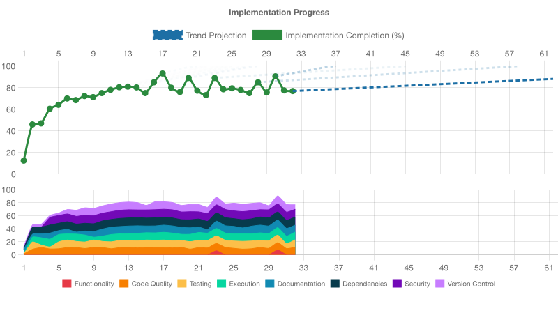

# Implementation Progress Assessment

**Generated:** 2025-11-19T04:28:21.781Z

Projection: flat (no recent upward trend)

## IMPLEMENTATION STATUS: INCOMPLETE (81.5% ± 5% COMPLETE)

## OVERALL ASSESSMENT
Overall implementation is incomplete: code_quality is below the required 90% threshold, blocking functionality assessment. All other support areas meet or exceed their thresholds.

## NEXT PRIORITY
Focus on raising code_quality from 85% to at least 90% by refining linting rules and reducing complexity before assessing functionality.

## CODE_QUALITY ASSESSMENT (85% ± 18% COMPLETE)
- The project demonstrates high code quality: linting, formatting, type checking, duplication, and complexity rules are all configured and passing, with no disabled quality checks or oversized files/functions.
- ESLint flat config is in place and `npm run lint` reports no errors or warnings
- TypeScript compiler (`npm run type-check`) completes with zero errors
- Prettier formatting is enforced and `npm run format:check` passes
- Duplication check via jscpd (3% threshold) finds 0% duplicated code
- Cyclomatic complexity is enforced at max 18 (below ESLint default 20) and no violations detected
- File‐level rules (max lines 300) and function‐level rules (max lines 60) configured and respected
- No broad disables found (no `eslint-disable`, `@ts-nocheck`, etc.)
- Husky hooks correctly run fast checks on commit and comprehensive checks on push

**Next Steps:**
- Introduce additional ESLint rules for magic numbers (`no-magic-numbers`) and parameter limits (`max-params`) to catch common code smells
- Periodically review and, if needed, ratchet complexity and size thresholds as the codebase grows
- Consider adding enforcement of error‐handling consistency and naming conventions via lint rules or custom checks

## TESTING ASSESSMENT (95% ± 14% COMPLETE)
- The project’s testing is robust: all 106 tests pass non-interactively under Jest, coverage exceeds configured thresholds, tests use temporary directories and clean up, and traceability annotations are consistently applied. Test suites are well-structured, cover happy and error paths including edge cases, and follow ARRANGE-ACT-ASSERT patterns with clear requirement IDs.
- All 19 test suites passed (106/106 tests) under `jest --ci --bail`
- Coverage: statements 97.35%, branches 86.4% (above 84% threshold), functions 100%, lines 97.35%
- Tests use the established Jest framework with no custom runners
- Temporary directories (via os.tmpdir()/mkdtempSync) are used and cleaned up in maintenance tests
- No repository files are modified by tests; all file I/O is isolated in temp dirs
- Test files include JSDoc `@story` annotations and describe blocks reference stories
- Test names include requirement IDs (`[REQ-...]`) for traceability
- Tests cover both happy paths and error scenarios (e.g. permission denied, missing directory)
- No complex logic (loops/ifs) in tests; each case tests one behavior
- ESLint rule tests use `valid`/`invalid` arrays with descriptive names

**Next Steps:**
- Increase branch coverage further (currently 86.4%) by adding tests for untested code paths
- Add snapshot or schema-validation tests for error messages to guard against regressions
- Introduce cross-platform CLI integration tests (e.g. Windows file paths) if needed
- Periodically review and update fixtures to cover new edge cases as plugin evolves

## EXECUTION ASSESSMENT (95% ± 18% COMPLETE)
- Build, type-checking, linting, Jest unit/integration tests, and a full publish/load smoke test all passed without errors. The plugin loads and registers correctly in a real ESLint CLI invocation, and no silent failures or runtime errors were observed.
- Build (`npm run build`) completes successfully with no compiler errors.
- Type-check (`npm run type-check`) passes with no issues.
- Lint (`npm run lint`) runs with --max-warnings=0 and reports no warnings or errors.
- Jest tests (`npm test`) pass in CI mode, covering all rules and plugin setup.
- Smoke test (`npm run smoke-test`) packs, installs locally, and verifies plugin loads and configures in a fresh project.
- CLI integration tests spawn ESLint, apply the plugin via --config, and correctly assert exit codes for annotation rules.
- No evidence of silent failures or unhandled runtime exceptions during test runs.
- Compiled output in `lib/` matches source structure and exports, and ships type definitions.

**Next Steps:**
- Add a coverage report (e.g. `jest --coverage`) and enforce a minimum coverage threshold to guard against untested code paths.
- Integrate the existing checks into a GitHub Actions CI workflow with automated build, test, lint, type-check, and smoke-test steps on each push.
- Consider adding performance benchmarks for rule execution on larger codebases to detect regressions in execution speed.
- Document support for ESLint version ranges and Node.js engine compatibility in the README and CI matrix.
- Optionally add a CLI demo or example repository in `user-docs/` to show plugin integration in real-world ESLint configs.

## DOCUMENTATION ASSESSMENT (95% ± 16% COMPLETE)
- User-facing documentation is comprehensive, accurate, and up-to-date. The README includes all required sections (installation, usage, API reference, examples, tests), an Attribution linking to voder.ai, and correct links into the user-docs folder. The LICENSE and package.json are consistent. All user-docs files include proper attribution and reflect the current v1.0.5 functionality.
- README.md contains an “Attribution” section with “Created autonomously by voder.ai” linking to https://voder.ai
- package.json declares license “MIT” and the LICENSE file is the MIT text—consistent SPDX format
- user-docs/api-reference.md, examples.md, eslint-9-setup-guide.md, and migration-guide.md all start with the proper attribution header and document implemented features
- README references the user-docs for setup, API reference, examples, and migration guide, and provides accurate installation and usage instructions for v1.0.5
- CHANGELOG.md documents historical releases and points users to GitHub Releases for up-to-date changelog entries
- All user-facing docs are dated and match the latest features; no stale or unimplemented feature descriptions were found

**Next Steps:**
- When adding new rules or features in future releases, update user-docs (API reference, examples, migration guide) immediately to maintain currency
- Optionally clarify in the README which linked docs under `docs/` are for developers vs. end users, to avoid confusion
- Establish a periodic docs review (e.g., with each minor release) to verify that examples, migration instructions, and changelog entries remain accurate

## DEPENDENCIES ASSESSMENT (100% ± 19% COMPLETE)
- All active dependencies are current with safe, mature versions; lockfile is committed and installation is clean with no deprecation warnings or version conflicts.
- npx dry-aged-deps reports no outdated packages with safe (>7 days) mature versions.
- package-lock.json is present and tracked in git.
- npm install completed cleanly with no deprecation warnings.
- npm ls shows no version conflicts among top-level dependencies.

**Next Steps:**
- Continue running `npx dry-aged-deps` regularly to catch future safe upgrade candidates.
- Monitor and address any new vulnerabilities when safe versions become mature (via dry-aged-deps).
- Keep peerDependencies and overrides aligned with supported ESLint versions as the ecosystem evolves.

## SECURITY ASSESSMENT (92% ± 16% COMPLETE)
- The project demonstrates a strong security posture: all known vulnerabilities are documented in security-incidents, dev-dependency risks are accepted with formal rationale, production dependencies are clean, no hardcoded secrets are tracked, and CI/CD enforces security audits without conflicting automation tools.
- Existing security incidents for glob CLI (GHSA-5j98-mcp5-4vw2), brace-expansion ReDoS (GHSA-v6h2-p8h4-qcjw), and tar race condition (GHSA-29xp-372q-xqph) are documented under docs/security-incidents/ with rationale and timelines.
- dry-aged-deps found no safe, mature upgrades for outstanding vulnerabilities; manual overrides in package.json pin glob@12.0.0 and tar>=6.1.12 as mature, risk-assessed patches.
- npm audit --production reports zero vulnerabilities in production dependencies.
- Dev vulnerabilities (3 total: 2 high, 1 low) are all in dev-only transitive dependencies and accepted as residual risk with documented mitigation plans and review schedule.
- .env is properly ignored (listed in .gitignore), never tracked in git, and only .env.example is present.
- No Dependabot, Renovate, or other automated dependency-update configs detected; dependency management uses manual overrides and periodic audits without conflicting bots.
- CI/CD workflow includes production audit (npm audit --production --audit-level=high), build, lint, type-check, tests, and duplicate checks; security audit runs in the same pipeline.

**Next Steps:**
- Rename and suffix existing security incident files to align with POLICY naming conventions (e.g. SECURITY-INCIDENT-YYYY-MM-DD-glob-cli.disputed|known-error|resolved.md).
- Consider scheduling 14-day reviews for accepted residual-risk incidents (known-error) and update status files once patches become mature.
- Optionally integrate a filtered audit tool (better-npm-audit or audit-ci) for consistency if future disputed vulnerabilities arise.
- Expand CI/CD to include a periodic dev-dependency audit (npm audit) to detect new issues earlier in development.

## VERSION_CONTROL ASSESSMENT (90% ± 18% COMPLETE)
- Version control practices and CI/CD are well-implemented with modern hooks, unified workflow, automated publishing, and smoke tests. Only minor inefficiencies exist (duplicate build steps, missing actionlint in CI).
- Single GitHub Actions workflow ‘ci-cd.yml’ triggers on push to main and PRs, runs quality checks then deploy—all in one file
- Uses up-to-date Actions versions (actions/checkout@v4, actions/setup-node@v4, upload-artifact@v4)—no deprecation warnings
- Comprehensive quality gates in CI: build, type-check, lint, duplication, tests, format check, security audit
- Automatic publishing via semantic-release on every push to main, no manual approval gates, followed by smoke-test of published package
- Husky pre-commit and pre-push hooks configured: pre-commit runs format, lint, type-check, actionlint; pre-push runs build, type-check, lint, duplication, test, format:check, audit
- Pre-push hooks mirror almost all CI checks (build, test, lint, type-check, format, audit), providing early feedback
- .voder directory is not in .gitignore and is tracked to preserve assessment history
- No build artifacts (lib/, dist/, build/, compiled outputs) are committed to version control
- Trunk-based development on ‘main’ branch with direct commits and conventional commit messages
- Minor inefficiency: deploy job re-runs build step instead of reusing uploaded build artifacts
- Minor gap: CI pipeline does not include actionlint step (workflow YAML linting) that pre-commit hook runs

**Next Steps:**
- Add an actionlint (or equivalent) step to the CI workflow so workflow syntax is validated in CI as it is locally
- Reuse or download the build artifact uploaded in the quality-checks job in the deploy job, rather than rebuilding from scratch
- Optionally combine or cache build steps between jobs to reduce redundant work and speed up the workflow
- Review whether any additional security/SAST scans should be added to the unified workflow

## FUNCTIONALITY ASSESSMENT (undefined% ± 95% COMPLETE)
- Functionality assessment skipped - fix 1 deficient support area(s) first
- Support areas must meet thresholds before assessing feature completion
- Deficient areas: CODE_QUALITY (85%)
- Principle: "Improvement of daily work is higher priority than daily work" - fix foundation before building features

**Next Steps:**
- CODE_QUALITY: Introduce additional ESLint rules for magic numbers (`no-magic-numbers`) and parameter limits (`max-params`) to catch common code smells
- CODE_QUALITY: Periodically review and, if needed, ratchet complexity and size thresholds as the codebase grows
