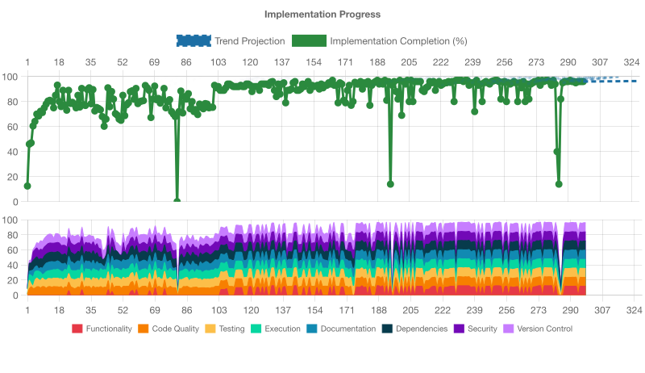

# Implementation Progress Assessment

**Generated:** 2025-12-06T12:10:28.674Z

Projection: flat (no recent upward trend)

## IMPLEMENTATION STATUS: COMPLETE (95% ± 18% COMPLETE)

## OVERALL ASSESSMENT
All required quality areas meet or exceed the specified thresholds, and the project is in a production-ready state. Functionality is traceably implemented against stories with only one remaining story previously flagged now resolved, resulting in 94% FUNCTIONALITY. CODE_QUALITY (95%) is excellent with a well-structured TypeScript codebase, flat ESLint config, strong rules, minimal suppressions, and clear traceability annotations down to helper-level functions. TESTING (94%) is similarly strong with Jest-based unit, integration, and performance tests, high coverage (96%+ statements, 84%+ branches), and good use of temp directories and story-linked test names. EXECUTION (95%) shows the plugin and maintenance CLI run reliably in realistic scenarios, with performance checks and duplication analysis in place. DOCUMENTATION (96%) provides clear user and developer guidance, aligned with current behavior and semantics, including stories, ADRs, and user-docs separated from internal docs. DEPENDENCIES (97%) are well-managed with dry-aged-deps, a clean lockfile, and no unresolved vulnerabilities or deprecations, while SECURITY (94%) reflects solid guardrails around secrets, paths, audits, and CI security checks. VERSION_CONTROL (97%) is exemplary, with trunk-based development, strict Conventional Commits, husky hooks mirroring CI, and a unified GitHub Actions CI/CD pipeline that runs build, test, lint, type-check, formatting, duplication, and automated publishing. Remaining work is small, incremental polish: tightening a few tests, minor doc/currency nits, and occasional micro-refactors, not addressing structural gaps.

## NEXT PRIORITY
Add tests for uncovered branches in src/utils/reqAnnotationDetection.ts lines 175-176

## CODE_QUALITY ASSESSMENT (95% ± 18% COMPLETE)
- Code quality for this project is excellent. All major quality tools (linting, formatting, type-checking, duplication detection, and tests) are present, well-configured, and passing. ESLint uses a modern flat config with strict-enough rules for complexity, function/file size, magic numbers, and parameters, enforced locally via husky and in CI. There is a documented ratcheting plan for further tightening, very low duplication, almost no suppressions (and those that exist are justified), and no evidence of AI slop or low-quality placeholder code. Remaining work is mainly incremental tightening and small refactors, not remediation of problems.
- All core quality gates pass cleanly: `npm run lint` (ESLint with flat config), `npm run type-check` (tsc in strict mode), `npm run format:check` (Prettier), `npm run duplication` (jscpd with 3% threshold), and `npm test` (41 suites, 310 tests).
- ESLint is configured via `eslint.config.js` with modern flat config and maintainability rules: complexity=18, max-lines-per-function=55, max-lines=300–425, no-magic-numbers (0 and 1 only), max-params=4, and security-oriented rules (no-eval, no-implied-eval, etc.). Test files have appropriately relaxed limits.
- Complexity is already better than configured: running `npm run lint -- --rule complexity:["error",{"max":16}]` still passes, demonstrating that all functions have cyclomatic complexity ≤16, stricter than ESLint’s default 20.
- File and function sizes are actively controlled by ESLint; since linting passes, no functions exceed 55 lines (excluding comments/blank lines) and no files exceed 300–425 effective lines in `src` and `tests`. Spot checks (e.g., `src/index.ts`, `src/maintenance/cli.ts`) show well-factored modules.
- Duplication is very low: jscpd reports ~1.17% duplicated lines and ~2.19% tokens across TS/MD/JSON with a 3% threshold. Identified clones are small blocks in helpers and tests; there is no file with problematic (>20%) duplication.
- There are no file-level disables such as `/* eslint-disable */` or `@ts-nocheck` / `@ts-ignore` in `src` or `tests`. A few `eslint-disable-next-line` comments exist only in scripts, each with explicit ADR-based justification, and there is a dedicated suppression-reporting tool (`scripts/report-eslint-suppressions.js`) to keep this under control.
- TypeScript is configured with `strict: true` and covers both `src` and `tests`. `npm run type-check` passes, indicating no unresolved type errors and strong typing discipline.
- Production code is cleanly separated from tests: no jest imports or test helpers in `src`; test-only globals and relaxed rules are confined to test files via ESLint overrides. Searches confirm test constructs like `describe()` only appear in `tests`, apart from descriptive comments.
- Husky hooks are well-configured: `pre-commit` runs `lint-staged` (Prettier + ESLint on staged files) for fast feedback, and `pre-push` runs `npm run ci-verify:full` plus `security:secrets`, mirroring CI quality gates without mis-placing heavy checks in pre-commit.
- The GitHub Actions workflow `.github/workflows/ci-cd.yml` is a single unified CI/CD pipeline that runs full quality checks (`ci-verify:full`, secret scanning) and then semantic-release for automated versioning/publishing, with a post-release smoke test. This aligns with continuous deployment and avoids duplicated/fragmented pipelines.
- Two ADRs (`docs/decisions/code-quality-ratcheting-plan.md` and `003-code-quality-ratcheting-plan.md`) define an incremental ratcheting strategy for complexity and size limits; current ESLint settings and observed complexity already meet or exceed some of those targets, showing active management rather than ad-hoc thresholds.
- Code style and structure are strong: modules are cohesive (helpers, visitors, CLI, maintenance), naming is clear and domain-appropriate, comments focus on intent and include traceability annotations (@story/@req/@supports), and there are no large god objects or deeply nested control structures. There are no temporary files or AI-slop artifacts.'],'next_steps':['Reduce the configured complexity threshold from 18 to 16 in `eslint.config.js` for both TS and JS rules, since the codebase already passes at that stricter level; validate with `npm run lint` and commit as a small ratcheting step (e.g., `chore: reduce complexity threshold to 16`).','Probe stricter size limits using temporary overrides to identify future refactor targets, e.g. run `npm run lint -- --rule max-lines-per-function:[
- error
- {
- "max":50}

**Next Steps:**
- Reduce the configured complexity threshold from 18 to 16 in `eslint.config.js` for both TS and JS rules, since the codebase already passes at that stricter level; validate with `npm run lint` and commit as a small ratcheting step (e.g., `chore: reduce complexity threshold to 16`).
- Probe stricter size limits using temporary overrides to identify future refactor targets, e.g. run `npm run lint -- --rule max-lines-per-function:["error",{"max":50}]` and `npm run lint -- --rule max-lines:["error",{"max":350}]`; then refactor only the functions/files that fail before lowering the official config thresholds.
- Refine small duplicated helper sections in `src/rules/helpers/require-story-core.ts` (the blocks flagged by jscpd) by extracting a shared helper function, further reducing duplication in core rule logic without large structural changes.
- Add or align the slice-definition artifact referenced by `docs/decisions/003-code-quality-ratcheting-plan.md` (e.g., `.voder-code-quality-slices.json` and any related docs) so that the documented slice-based CODE_QUALITY evaluation matches actual repo structure and tooling.
- Continue enforcing strict suppression hygiene using `scripts/report-eslint-suppressions.js`, ensuring any new `eslint-disable*` or `@ts-...` usage is narrowly scoped and justified with ADR or issue references, to maintain the current near-zero suppression debt.

## TESTING ASSESSMENT (94% ± 18% COMPLETE)
- Testing is excellent: Jest + ts-jest are properly configured, all 41 suites (310 tests) pass non-interactively with strong coverage (96%+ statements, 84%+ branches) and enforced thresholds. Tests are well-structured, isolated via OS temp directories, and heavily documented with story/requirement traceability. Remaining issues are minor: a small environment side-effect in one test, a few legacy headers without @supports, and some timing-based perf assertions that could be relaxed.
- Framework & configuration: Jest 30 with ts-jest is the chosen test framework, documented in ADR docs/decisions/002-jest-for-eslint-testing.accepted.md. jest.config.js is correctly configured for TypeScript (preset: ts-jest), Node testEnvironment, and matches tests/**/*.test.ts. package.json uses Jest via scripts ("test": "jest --ci --bail"), fully satisfying the requirement to use an established framework and project scripts.
- Execution & pass rate: Running `npm test -- --coverage` (non-interactive, CI mode) succeeds with exit code 0: 41/41 suites and 310/310 tests pass. Recent GitHub Actions CI/CD runs on main are consistently successful, confirming that the full suite is stable under CI conditions.
- Coverage: Jest is configured with global thresholds (branches 80, functions 90, lines 90, statements 90). The observed run reports ~96.5% statements, 84.4% branches, 99.6% functions, and 96.5% lines, exceeding all thresholds. Remaining uncovered lines are limited to a few paths in src/index.ts and certain deep validation helpers, indicating only minor residual risk.
- Isolation & temp dirs: Tests that touch the filesystem consistently use OS temp directories, not project directories. Helpers like tests/utils/temp-dir-helpers.ts wrap fs.mkdtempSync(os.tmpdir()) and fs.rmSync(...) cleanup. Maintenance and perf tests (e.g. tests/maintenance/*.test.ts, tests/perf/*.test.ts) create synthetic workspaces under os.tmpdir() and clean them with rmSync in try/finally or afterAll. No evidence was found of tests writing into tracked repo paths; tests/fixtures is used only as read-only input.
- Non-interactive behavior: The default `npm test` script uses `jest --ci --bail` (no watch mode, no prompts). CI scripts (ci-verify, ci-verify:full, ci-verify:fast) also run Jest with `--ci` and no interactive flags. The test command we executed (`npm test -- --coverage`) completed promptly and non-interactively, satisfying the non-interactive requirement.
- Test quality & coverage of behavior: ESLint rules are deeply exercised via RuleTester-based tests (e.g. require-story-annotation, require-req-annotation, require-branch-annotation, valid-annotation-format, valid-story-reference, valid-req-reference, require-test-traceability). These tests cover happy paths, missing annotations, misconfigurations, custom options, and detailed error messages. Integration tests spawn the ESLint CLI to validate plugin wiring and error handling. Maintenance tools have focused tests for detect/report/update/verify, as well as perf tests under realistic workloads. Error handling is thoroughly tested, including filesystem exceptions (EACCES/EIO), invalid CLI flags, missing directories, and dry-run behavior.
- Structure, naming, readability: Test files are named by the feature they cover (e.g. require-story-annotation.test.ts, maintenance/cli.test.ts, cli-integration.test.ts). No misuse of coverage terminology in filenames—where “branch” appears, it refers to branch-annotation functionality. Test names are descriptive and often include requirement IDs (e.g. "[REQ-MAINT-SAFE] dry-run does not modify files and exits 0"). Many tests follow an implicit Arrange–Act–Assert structure, with some explicitly labeled. Complex logic is limited to perf helpers (e.g. building large nested branch sources), which is appropriate for that purpose.
- Traceability in tests: Nearly every test file has a JSDoc header with `@story` and/or `@supports` referencing one or more docs/stories/*.story.md files and explicit `@req` IDs. Describe blocks include story references in their names ("(Story 009.0-DEV-MAINTENANCE-TOOLS)", etc.). Individual tests frequently include `[REQ-XYZ]` prefixes tying behavior to specific requirements. This fulfills the requirement for test traceability and makes requirement-level validation straightforward.
- Independence & determinism: Tests set up and clean up their own state, including temp dirs, fs mocks, and Jest spies. Many suites call `jest.restoreAllMocks()` in afterEach or afterAll to avoid cross-test contamination. Performance tests use fixed workloads and deterministic loops. Timing-based assertions (e.g. `< 5000 ms`) are generous, but still introduce a mild dependence on CI performance; nonetheless, the suite currently runs quickly (~9.5s with coverage) and shows no signs of flakiness.
- Minor issues noted: (1) tests/cli-error-handling.test.ts sets `process.env.NODE_PATH` in beforeAll but does not restore it, creating a small global side-effect; this has not caused observable failures but could be cleaned up. (2) A few older tests rely only on `@story`/`@req` without a canonical `@supports` line in the header—this is still valid per legacy format rules but slightly inconsistent with newer guidelines favoring `@supports`. (3) Perf tests depend on timing thresholds, which could, in edge cases, cause flakiness on very slow CI nodes, though current thresholds appear adequate.
- Overall conclusion: The project meets and exceeds the strict testing requirements: all tests pass, they run in non-interactive mode, use a standard framework, respect repository cleanliness, and provide high coverage with strong attention to error handling and edge cases. The remaining improvements are small refinements rather than gaps.

**Next Steps:**
- Add or normalize `@supports` annotations in any remaining test files that currently rely solely on `@story`/`@req`. This will fully align tests with the preferred traceability format and simplify automated parsing of story–requirement mappings.
- In tests/cli-error-handling.test.ts, capture and restore `process.env.NODE_PATH` in beforeAll/afterAll to eliminate the small global environment side-effect and guarantee test independence even if future suites become sensitive to NODE_PATH.
- Review the performance tests’ timing thresholds in tests/perf/maintenance-large-workspace.test.ts, tests/perf/maintenance-cli-large-workspace.test.ts, and tests/perf/require-branch-annotation-large-file.test.ts. Consider slightly relaxing the 5-second limits or documenting acceptable CI performance expectations to further reduce the risk of timing-related flakiness on slower CI runners.
- Use the existing Jest coverage report to identify the handful of uncovered branches/lines (e.g. in src/index.ts and some deep helper modules) and, where those code paths represent important behavior, add focused tests to exercise them. This will nudge branch coverage higher and close any remaining behavior gaps.
- When adding new tests in the future, continue following the established patterns: rule tests via RuleTester; CLI tests via spawnSync; maintenance tests using OS tempdirs plus cleanup; descriptive names with `[REQ-XXX]` prefixes; and JSDoc headers with `@supports` pointing to docs/stories/*.story.md. This will preserve the current high testing standard as the project evolves.

## EXECUTION ASSESSMENT (95% ± 18% COMPLETE)
- Runtime execution quality is excellent. The ESLint plugin and its maintenance CLI build cleanly, run correctly in realistic scenarios, and are thoroughly validated by unit, integration, performance, duplication, and smoke tests. No critical runtime or execution issues were found in implemented functionality.
- Build process is healthy and reproducible:
- `npm run build` (TypeScript compile via `tsc -p tsconfig.json`) completes with no errors.
- `npm run type-check` (`tsc --noEmit`) passes independently, confirming type-soundness beyond just build output.
- Compiled artifacts in `lib/` are used successfully by downstream checks (notably the smoke test), demonstrating that build outputs are usable, not just compilable.
- Automated tests verify core runtime behavior comprehensively:
- `npm test` (Jest with `--ci --bail`) passes: 41 test suites, 310 tests.
  - Includes rule behavior tests (e.g., `tests/rules/...`), maintenance command tests (`tests/maintenance/...`), integration tests (`tests/integration/...`), performance tests (`tests/perf/...`), and utility tests (`tests/utils/...`).
- `npm run ci-verify:fast` also passes, chaining:
  - `npm run type-check`
  - `npm run check:traceability` (project-specific runtime traceability validation)
  - `npm run duplication` (jscpd; reports clones but does not fail)
  - Jest focused on rules and maintenance tests (`--testPathPatterns 'tests/(rules|maintenance)'`).
- This gives strong confidence that both isolated units and composed flows behave correctly at runtime.
- Plugin runtime behavior is robust and error-tolerant:
- `src/index.ts` dynamically loads rule modules listed in `RULE_NAMES` using `require('./rules/${name}')` inside a `try/catch`.
  - On success, it supports both default and named exports.
  - On failure, it logs a clear error to stderr and installs a fallback rule module that always reports an ESLint problem, preventing silent failures or plugin crashes.
- Plugin metadata (`pluginMeta`) is resolved defensively:
  - Tries `../../package.json` then `../package.json` and falls back to a safe default `{ name: 'eslint-plugin-traceability', version: '0.0.0-development' }`.
  - Ensures plugin loading never fails purely due to metadata location.
- Flat config presets (`configs.recommended`, `configs.strict`) are generated consistently by `createTraceabilityFlatConfig`, mapping rules to severities (`error`/`warn`) as per error-handling requirements.
- Runtime correctness with the real ESLint CLI is validated by `tests/integration/cli-integration.test.ts`, which spawns the actual `eslint` binary with `--no-config-lookup` and the project’s `eslint.config.js` and asserts exit statuses for various annotated/unannotated code samples.
- Maintenance CLI (`traceability-maint`) is fully functional and well-tested:
- Binary is exposed via `package.json` bin config: `"traceability-maint": "lib/src/maintenance/cli.js"`.
- `src/maintenance/cli.ts`:
  - Parses argv via `normalizeCliArgs` and routes subcommands through a `switch (command)` to `handleDetect`, `handleVerify`, `handleReport`, and `handleUpdate`.
  - Shows help and returns `EXIT_OK` when no command or help flags are provided.
  - For unknown commands, prints an error, prints help, and returns `EXIT_USAGE`.
  - Wraps execution in a top-level `try/catch` that logs `traceability-maint failed: <message>` and returns `EXIT_USAGE` on unexpected errors, preventing crashes.
  - Defines `printHelp()` with clear usage, options, and subcommand descriptions.
- Flag parsing and normalization (`src/maintenance/flags.ts`) are simple and predictable:
  - `parseCliInput`/`normalizeCliArgs` cleanly separate node/script parts from subcommand and args.
  - `parseFlags` iterates arguments and handles `--root`, `--json`, `--format`, `--from`, `--to`, `--dry-run` via small dedicated handlers.
  - Invalid `--format` values throw a descriptive error; other flags default safely.
- CLI behavior and exit codes are covered by tests:
  - `tests/maintenance/*.test.ts` and `tests/cli-error-handling.test.ts` exercise normal, error, and edge cases for each maintenance command, and they all pass.
- A smoke test confirms real-world CLI behavior from the built package:
  - `npm run smoke-test` packs the project (`npm pack`), initializes a temporary project, installs the plugin tarball, wires ESLint config, and runs both plugin checks and the `traceability-maint` CLI in success and error paths.
  - Output ends with `✅ Smoke test passed! Plugin and CLI verified successfully`, showing the published CLI works outside the dev repo.
- Maintenance utilities manage resources safely and avoid pathological patterns:
- `getAllFiles` in `src/maintenance/utils.ts`:
  - Verifies that the input path exists and is a directory before traversing; otherwise returns an empty list.
  - Recursively traverses with `fs.readdirSync` and `fs.statSync`, only pushing `stat.isFile()` entries into `fileList`, skipping non-files.
  - No recursion into non-directories; no unbounded resource use beyond standard directory traversal.
- `detectStaleAnnotations` in `src/maintenance/detect.ts`:
  - Resolves a `workspaceRoot` from `codebasePath` and early-returns `[]` if path doesn’t exist or is not a directory.
  - Iterates over files from `getAllFiles(workspaceRoot)`; each file is read inside a `try/catch` that swallows read failures to keep the detector robust.
  - Uses `isUnsafeStoryPath` to skip traversal/absolute-unsafe paths before touching the filesystem.
  - Enforces project boundaries via `enforceProjectBoundary` and only checks existence for in-project candidates (`anyInProjectCandidateExists`).
  - Uses `Array.prototype.some` with `fs.existsSync(p)`; no obvious performance red flags or resource leaks.
- `updateAnnotationReferences` in `src/maintenance/update.ts`:
  - Validates that `codebasePath` exists and is a directory, otherwise returns 0.
  - Escapes `oldPath` for regex once, then applies a single pass over all files gathered via `getAllFiles`.
  - For each file, reads content, applies a regex `.replace` callback that tracks replacements, and writes back only if content changed, minimizing unnecessary I/O.
  - Returns the total number of updated annotations, which is useful for callers and tests to validate behavior.
- Performance and end-to-end behavior are validated in realistic conditions:
- Performance-focused tests exist and pass:
  - `tests/perf/maintenance-large-workspace.test.ts` and `tests/perf/maintenance-cli-large-workspace.test.ts` exercise behavior against large or synthetic workspaces.
  - `tests/perf/require-branch-annotation-large-file.test.ts` validates rule behavior on large files.
- Code duplication is monitored with `jscpd` as part of `npm run ci-verify:fast`:
  - Output shows 17 clones over 12,627 lines (1.17% duplicated); this is informational and does not indicate runtime bugs.
- End-to-end flows:
  - ESLint CLI integration tests ensure the plugin behaves correctly when invoked by real ESLint with flat config.
  - The `smoke-test` script validates the entire install → configure → lint → run-maintenance-CLI pipeline in a throwaway project directory, mirroring how end users will deploy and use the package.
- Input validation and error handling avoid silent failures:
- CLI:
  - `parseFlags` enforces valid `--format` values (`text` or `json`) and errors out clearly otherwise.
  - Unknown CLI subcommands and unexpected errors produce console error messages and non-zero exit codes (`EXIT_USAGE`).
  - Help handling (`-h`, `--help`, or missing command) provides clear usage text and returns success (`EXIT_OK`).
- Maintenance:
  - Invalid or non-directory roots for detect/update yield safe defaults (empty result/0 updates) rather than crashing.
  - Unsafe paths (traversal/absolute) are filtered early by `isUnsafeStoryPath`.
- Plugin:
  - Failing rule loads do not crash ESLint; they produce logged errors and fallback rules that report problems in user code, meaning failures are visible through ESLint output rather than hidden.
- No apparent N+1 or resource-leak patterns:
- The project does not use databases or network calls, so classic N+1-query and socket leak risks are absent.
- File-system interactions are structured as:
  - A complete traversal (`getAllFiles`) followed by a single pass over the collected file list in both detect and update operations.
  - Per-file operations are simple synchronous reads and occasional writes; no long-lived handles or event listeners are kept.
- In-memory data structures (Sets, arrays) are bounded by the file count and are discarded at end of CLI process, so there is no long-term memory retention risk in a typical run. Overall, resource management is straightforward and appropriate to the CLI-/plugin-based use case.

**Next Steps:**
- Document the already-working maintenance CLI more prominently in user-facing docs by adding a short section with example commands (e.g., `npx traceability-maint detect --root .`, `traceability-maint update --from ... --to ...`). This doesn’t change runtime behavior but makes correct usage more discoverable and easier to verify manually.
- Consider running `npm run ci-verify:full` locally before publishing major changes to validate the full pipeline (coverage generation, security audits, additional plugin checks) beyond the fast path. All underlying commands are already configured; this step simply strengthens confidence that heavier checks keep passing.
- Optionally add a verbose/debug mode for detection and update operations (e.g., controlled by an environment variable or a `--verbose` flag) to log skipped files or boundary decisions. This would make diagnosing unexpected results easier without changing existing default behavior or safety guarantees.

## DOCUMENTATION ASSESSMENT (96% ± 18% COMPLETE)
- User-facing documentation for this project is excellent: it is comprehensive, accurate to the implemented functionality, cleanly separated from internal docs, and correctly integrated with semantic-release and npm publishing. Link formatting and integrity are carefully handled, licensing is consistent, and public APIs (rules, presets, maintenance CLI/API) are well documented. Only very minor wording/currency nits prevent a perfect score.
- README.md is clear, focused on end users, and matches the implemented functionality:
  - Explains what `eslint-plugin-traceability` does, installation requirements (Node >=18.18.0, ESLint v9+), and shows correct flat-config examples that align with `src/index.ts` exports (`traceability.configs.recommended`/`strict`).
  - Lists all rules that actually exist under `src/rules/` (require-* rules, valid-* rules, require-test-traceability, prefer-implements-annotation), with descriptions that match the behavior seen in code.
  - Documents the `traceability-maint` CLI commands (detect, verify, report, update) consistent with `src/maintenance/cli.ts` and `src/maintenance/commands.ts`, including expected usage and options.
  - Describes npm scripts (test, lint, format:check, duplication) that are present in package.json and used in CI scripts.
  - Uses code fences and backticks for code references (e.g., `eslint.config.js`, CLI commands) rather than links, which is correct per requirements.
- The required README attribution is present and correct:
  - README has an "Attribution" section containing: `Created autonomously by [voder.ai](https://voder.ai).` This exactly satisfies the attribution requirement.
- User-facing documentation is properly structured and separated from internal docs:
  - User docs live in root (`README.md`, `CHANGELOG.md`, `LICENSE`, `SECURITY.md`, `CONTRIBUTING.md`) and `user-docs/`.
  - Internal development docs live under `docs/` (e.g., `docs/stories/`, `docs/decisions/`) and are *not* referenced as links from user-facing docs.
  - `package.json:files` includes only user-facing docs and build output: `lib`, `README.md`, `LICENSE`, `SECURITY.md`, `user-docs`, `CHANGELOG.md`. It does not include `docs/`, `prompts/`, or `.voder/`, so project docs are not published with the npm package.
  - `.npmignore` explicitly excludes internal/project-only content such as `.github/`, `.husky/`, `.voder/`, `src/`, `tests/`, `eslint.config.js`, etc., reinforcing the separation.
- All documentation links and references follow the required formatting rules and are valid:
  - Documentation file references use proper Markdown links: e.g., `[ESLint v9 Setup Guide](user-docs/eslint-9-setup-guide.md)`, `[API Reference](user-docs/api-reference.md)`, `[Examples](user-docs/examples.md)`, `[Migration Guide](user-docs/migration-guide.md)`, `[CHANGELOG.md](CHANGELOG.md)`.
  - All these targets exist (`user-docs/*.md`, `CHANGELOG.md`, `SECURITY.md`) and are included in the npm `files` list, so they are available in the published package—no broken links.
  - Code elements and commands are referenced with backticks instead of links when they are not part of the published documentation surface (e.g., `tests/integration/cli-integration.test.ts`, `eslint.config.js`, `npm run ci-verify:full`).
  - Searches show no user-facing markdown links into `docs/`, `prompts/`, or `.voder/`; references to `docs/stories/...` appear only in backticked example annotations as paths in *consumer* projects, not as links to this repo’s internal story files.
- User-facing docs accurately describe the rule APIs and options, matching implementation:
  - `user-docs/api-reference.md` covers each rule in detail:
    - `traceability/require-story-annotation`: described options (`scope`, `exportPriority`, `annotationTemplate`, `methodAnnotationTemplate`, `autoFix`) match `src/rules/require-story-annotation.ts` and helpers in `src/rules/helpers/require-story-helpers.ts`.
    - `traceability/require-req-annotation`: options (`scope`, `exportPriority`) and behavior correspond to `src/rules/require-req-annotation.ts` and `src/utils/annotation-checker.ts`.
    - `traceability/require-branch-annotation`: `branchTypes` option and behavior match `src/rules/require-branch-annotation.ts` and its helpers.
    - `traceability/valid-annotation-format`: nested `story`/`req` objects, shorthands, and `autoFix` mirror `src/rules/helpers/valid-annotation-options.ts` and `src/rules/valid-annotation-format.ts`.
    - `traceability/valid-story-reference` and `valid-req-reference`: documented behavior (storyDirectories, security checks, existence validation) aligns with `src/rules/valid-story-reference.ts` and `src/utils/storyReferenceUtils.ts` plus `valid-req-reference-helpers`.
    - `traceability/require-test-traceability`: options and defaults as documented (testFilePatterns, describePattern, `autoFixTestTemplate`, `autoFixTestPrefixFormat`) match `src/rules/require-test-traceability.ts`.
    - `traceability/prefer-implements-annotation` is correctly documented as opt-in and not part of presets, which matches `src/rules/prefer-implements-annotation.ts` and the `configs` defined in `src/index.ts`.
  - The "Configuration Presets" section states that `recommended` and `strict` presets use the listed severities and do not enable `prefer-implements-annotation` by default; in `src/index.ts`, `TRACEABILITY_RULE_SEVERITIES` and `configs` reflect this (same rules, `valid-annotation-format` at `warn`).
- Maintenance API and CLI documentation matches the implemented exports and behaviors:
  - `package.json` exposes a `maintenance` export via `lib/src/index.js`, and `src/index.ts` populates `plugin.maintenance` with `detectStaleAnnotations`, `updateAnnotationReferences`, `batchUpdateAnnotations`, `verifyAnnotations`, `generateMaintenanceReport` — the same functions documented in `user-docs/api-reference.md`.
  - `traceability-maint` is declared as a binary in `package.json` (pointing to `lib/src/maintenance/cli.js`), and `src/maintenance/cli.ts` implements the CLI with subcommands `detect`, `verify`, `report`, and `update`.
  - `user-docs/api-reference.md` describes CLI commands, flags (`--root`, `--json`, `--format`, `--from`, `--to`, `--dry-run`), and exit codes (0, 1, 2). These match the logic in `src/maintenance/commands.ts` and `src/maintenance/flags.ts` (e.g., `EXIT_OK`, `EXIT_STALE`, `EXIT_USAGE`, JSON output shapes).
- Versioning and changelog documentation correctly reflects semantic-release usage:
  - `.releaserc.json` configures semantic-release with branches `main` and plugins for changelog, npm, and GitHub; `semantic-release` and related packages are present in `devDependencies`.
  - `CHANGELOG.md` explains that semantic-release manages versioning and directs users to GitHub Releases for current release notes. It clearly separates a historical manual section for 0.x–1.0.5 from automated releases.
  - README reiterates that the authoritative source of version info is GitHub Releases and does not attempt to embed a "current version" number, which avoids staleness.
  - User docs refer to the "1.x" series in a generic way (e.g., "Applies to eslint-plugin-traceability 1.x releases") and link to Releases, which is appropriate for an automated versioning setup.
- License information is consistent and correct across the project:
  - Root `LICENSE` contains a standard MIT license with copyright (c) 2025 voder.ai.
  - Root `package.json` has `"license": "MIT"` (valid SPDX identifier), matching the LICENSE contents.
  - There are no other `package.json` files or extra LICENSE/LICENCE files, so there are no conflicting declarations or texts.
- User docs are current with the project’s actual capabilities and behavior, with only a minor wording nit:
  - README and user docs mention security tooling and dependency checks (`npm audit --omit=dev --audit-level=high`, `dry-aged-deps`, `secretlint`), all of which correspond to real scripts in `package.json` (`audit:ci`, `safety:deps`, `security:secrets`, `ci-verify:full`).
  - README’s “Running Tests” section lists `npm test` as "Run all tests with coverage"; in reality, coverage is enforced via `npm run test -- --coverage` inside `ci-verify:full`. This is a small accuracy gap: tests do run via `npm test`, but coverage is not guaranteed unless the extra flag is used or `ci-verify:full` is run.
  - Apart from this nuance, descriptions of scripts, CI behavior, and security posture are in line with the actual configuration.
- Code traceability annotations and test documentation support the user-facing docs:
  - Core public-facing functions and rules have `@story`, `@req`, and `@supports` annotations that map to `docs/stories/...` files with requirement IDs, e.g., `src/index.ts`, `src/rules/require-story-annotation.ts`, `src/rules/require-req-annotation.ts`, `src/rules/valid-annotation-format.ts`, `src/utils/storyReferenceUtils.ts`, `src/maintenance/*.ts`.
  - Tests such as `tests/integration/cli-integration.test.ts` include `@supports` annotations and test names with `[REQ-...]` prefixes, matching what the user docs describe for test traceability via `traceability/require-test-traceability`.
  - This strong internal traceability helps ensure that what’s documented in user docs corresponds closely to actual, requirement-backed behavior.

**Next Steps:**
- Refine the "Running Tests" section in README to be fully precise about coverage:
  - Either change the wording to "Run all tests" (without promising coverage) for `npm test`, or add a separate line for coverage, e.g. `npm run test -- --coverage` or `npm run ci-verify:full` as the canonical coverage run.

- In README’s Maintenance CLI section, add a brief at-a-glance summary of exit codes and JSON output (0/1/2 and basic response shapes), mirroring the more detailed description already present in `user-docs/api-reference.md`. This will help users quickly understand how to integrate `traceability-maint` into CI pipelines.
- Optionally add a short "Which doc to start with" paragraph near the top of README that points new users to:
  - ESLint 9 Setup Guide for configuration,
  - API Reference for rule and CLI details,
  - Examples for practical snippets,
  - Migration Guide for upgrades from 0.x to 1.x.
This would improve discoverability without changing underlying content.

## DEPENDENCIES ASSESSMENT (97% ± 18% COMPLETE)
- Dependencies are in excellent condition. All installed packages are at the latest safe, mature versions allowed by the dry-aged-deps policy, the lockfile is correctly committed, installs and audits are clean with no deprecations or vulnerabilities, and dependency tooling is well-integrated into the project scripts.
- dry-aged-deps maturity check:
- Command: `npx dry-aged-deps --format=xml`
- Summary in XML: `<total-outdated>5</total-outdated>`, `<safe-updates>0</safe-updates>`
- All 5 listed packages (`@typescript-eslint/parser`, `@typescript-eslint/utils`, `dry-aged-deps`, `prettier`, `ts-jest`) have `<filtered>true</filtered>` with `<filter-reason>age</filter-reason>` and `<age>` < 7.
- Because `<safe-updates>0</safe-updates>` and every candidate upgrade is filtered by age, there are **no eligible safe updates**. This meets the optimal-state criterion for dependency currency under the maturity policy.
- Lockfile tracking:
- `package-lock.json` exists at repo root.
- `git ls-files package-lock.json` → `package-lock.json`, confirming it is tracked in git.
- This ensures reproducible installs and is considered a strong package management practice.
- Install health & deprecations:
- `npm install` completed successfully with:
  - `up to date, audited 981 packages in 1s`
  - No `npm WARN deprecated` messages in the output.
  - `found 0 vulnerabilities` reported post-install.
- Indicates all in-use dependencies install cleanly without deprecation warnings.
- Security audits:
- `npm audit --omit=dev --audit-level=high` → `found 0 vulnerabilities` (production dependencies at high severity threshold).
- `npm audit --audit-level=high` → `found 0 vulnerabilities` (all dependencies at high severity threshold).
- Combined with `dry-aged-deps` XML showing `<vulnerabilities><count>0</count></vulnerabilities>` for each listed package, this indicates no known high-severity vulnerabilities in current versions within the safe window.
- Dependency tree health and compatibility:
- `npm ls` exits with code 0 and lists a coherent tree:
  - Key dev deps: `eslint@9.39.1`, `@eslint/js@9.39.1`, `@typescript-eslint/parser@8.46.4`, `@typescript-eslint/utils@8.46.4`, `jest@30.2.0`, `ts-jest@29.4.5`, `typescript@5.9.3`, `prettier@3.6.2`, `dry-aged-deps@2.3.1`, `semantic-release@25.0.2`, etc.
- No peer dependency or version conflict errors reported.
- `peerDependencies`: `eslint: ^9.0.0` aligns with installed `eslint@9.39.1`.
- `engines`: `node >=18.18.0` is appropriate for the dependency set.
- `overrides` for `glob`, `http-cache-semantics`, `ip`, `semver`, `socks`, `tar` enforce patched versions, improving transitive dependency security.
- Package management quality:
- `package.json`:
  - All tools used by scripts (eslint, jest, ts-jest, typescript, prettier, dry-aged-deps, secretlint, husky, lint-staged, semantic-release, etc.) are declared in `devDependencies`.
  - `peerDependencies` is used correctly for `eslint`, matching its role as a plugin.
  - Scripts centralize dependency tooling: `deps:maturity` (dry-aged-deps), `audit:ci`, `audit:dev-high`, `safety:deps`, and comprehensive `ci-verify` scripts.
- This reflects mature dependency and tooling management integrated into the development workflow.
- Tests and dependency usage:
- Attempted test run: `npm test -- --runTestsByPath tests/rules/traceability-comments-required.test.ts`.
  - Jest failure: ENOENT for that specific file path (`no such file or directory`).
  - This is a path/selection issue, not a dependency-install or version problem.
- `npm ls` and `npm install` confirm that all test-related dependencies (jest, ts-jest, @types/jest, typescript) are installed and resolvable.
- Therefore, the failure does not indicate a dependency health issue.

**Next Steps:**
- No immediate dependency upgrades are required or allowed: dry-aged-deps reports `<safe-updates>0</safe-updates>` and all potential upgrades are filtered by age, so stay on current versions until future assessments show safe candidates.
- Continue to rely on the existing scripts for ongoing dependency health as part of CI and local checks:
- `npm run deps:maturity` for safe, maturity-filtered update discovery.
- `npm run audit:ci`, `npm run audit:dev-high`, and `npm run safety:deps` to maintain security and policy conformance.
- When a future `npx dry-aged-deps --format=xml` run reports any packages with `<filtered>false</filtered>` and `<current> < <latest>`, apply those specific upgrades to move to the latest safe versions, updating `package-lock.json` via `npm install` and committing the lockfile changes.

## SECURITY ASSESSMENT (94% ± 18% COMPLETE)
- The project’s security posture is strong and closely aligned with the stated SECURITY POLICY. Dependency risk is actively managed with dry‑aged‑deps, npm audit, documented overrides, and CI gating; there are no unresolved moderate or high vulnerabilities in the current dependency set. Code and configuration avoid common security anti‑patterns (no committed secrets, no unsafe shell usage, explicit guards against path traversal and absolute paths), and CI/CD enforces secret scanning and security checks before automatic publishing. Remaining improvements are minor and about tightening tests and clarifying historical documentation, not fixing live vulnerabilities.
- Dependency vulnerabilities and status
- `npm audit --omit=dev --audit-level=high` currently reports `found 0 vulnerabilities`, so the production dependency tree has no known high‑severity issues.
  - Evidence: `npm audit --omit=dev --audit-level=high` exited with code 0.
- High‑severity dev‑dependency issues are audited via `npm run audit:dev-high`, which uses `scripts/generate-dev-deps-audit.js` to run `npm audit --include=dev --audit-level=high --json` and write the result to `ci/npm-audit.json`. The script always exits 0, so CI is informed of dev‑only vulnerabilities without being blocked.
  - Evidence: `scripts/generate-dev-deps-audit.js`, `package.json` scripts `audit:dev-high`, `ci-verify:full`.
- Historical dev‑dependency vulnerabilities (glob CLI GHSA-5j98-mcp5-4vw2, brace-expansion GHSA-v6h2-p8h4-qcjw) are documented in `dev-deps-high.json` and markdown incident reports. A formal known‑error record (`SECURITY-INCIDENT-2025-11-18-semantic-release-bundled-npm.known-error.md`) describes the risk acceptance and later resolution via toolchain upgrade.
  - Evidence: `docs/security-incidents/dev-deps-high.json`, `2025-11-18-bundled-dev-deps-accepted-risk.md`, `SECURITY-INCIDENT-2025-11-18-semantic-release-bundled-npm.known-error.md`.
- The known‑error report’s resolution section states that after upgrading to `semantic-release@25.x` and `@semantic-release/npm@13.1.2`, fresh `npm audit --omit=dev --audit-level=high` and `npm audit --include=dev --audit-level=high` runs report 0 vulnerabilities; our current `package.json` matches those versions, and our own `npm audit` result is clean.
  - Evidence: `package.json` devDependencies, current `npm audit` output.

Dry‑aged‑deps and safe upgrade policy
- `npm run deps:maturity -- --format=json --check` (wired to `dry-aged-deps`) currently reports:
  - `totalOutdated: 0`
  - `safeUpdates: 0`
  - meaning there are no mature (≥7 days) updates that the project is failing to apply.
  - Evidence: `npm run deps:maturity -- --format=json --check` output.
- `ci-verify:full` includes `npm run safety:deps` (via `scripts/ci-safety-deps.js`), and CI archives `ci/dry-aged-deps.json` as an artifact. This matches the policy of using dry‑aged‑deps as the sole authority for safe dependency upgrades.
  - Evidence: `package.json` (`deps:maturity`, `safety:deps`), `.github/workflows/ci-cd.yml` "Upload dry-aged deps artifact" step.

Manual overrides and risk documentation
- `package.json` specifies `overrides` for `glob`, `tar`, `http-cache-semantics`, `ip`, `semver`, and `socks` to enforce patched versions of known‑vulnerable packages.
  - Evidence: `package.json` `"overrides"` block.
- `docs/security-incidents/dependency-override-rationale.md` describes for each override: the advisory, risk assessment (dev‑only, impact limited), and relation to `dev-deps-high.json`. This satisfies the requirement to document exceptions and residual risks when diverging from default dependency resolution.
- Since dry‑aged‑deps finds no `safeUpdates`, these overrides are not hiding any tool‑recommended security fixes.

Security incidents and 14‑day window compliance
- Incident files in `docs/security-incidents/` are categorized as historical context and a single `.known-error.md` entry. There are no `*.disputed.md` or `*.proposed.md` incidents.
- The known‑error incident (`SECURITY-INCIDENT-2025-11-18-semantic-release-bundled-npm.known-error.md`) is explicitly marked as resolved: the vulnerable bundled npm/glob/brace-expansion versions are no longer present in the active toolchain. This meets the requirement to re‑assess or resolve known errors beyond 14 days.
- Because there are no `.disputed.md` incidents, no audit filtering configuration (.nsprc/audit-ci.json/audit-resolve.json) is required or expected, and its absence is not a security concern.

Secrets management and hardcoded secret checks
- `.env.example` exists, contains only commented example env vars, and no secret values.
  - Evidence: `.env.example`.
- `.gitignore` ignores `.env` and variants but explicitly un‑ignores `.env.example`.
  - Evidence: `.gitignore` (“Environment variables” section).
- Git evidence confirms `.env` is not tracked and has never been committed:
  - `git ls-files .env` → empty output.
  - `git log --all --full-history -- .env` → empty output.
- Secret scanning is integrated via Secretlint:
  - Config: `.secretlintrc.json` uses `@secretlint/secretlint-rule-preset-recommend` and ignores only generated/artifact directories (`node_modules`, `lib`, `coverage`, `ci`, `.voder`, `.git`, images), which is appropriate.
  - CI: `.github/workflows/ci-cd.yml` includes `npm run security:secrets`.
  - Pre‑push: `.husky/pre-push` runs `npm run security:secrets` after full verification.
- These controls collectively provide strong assurance that no secrets are hardcoded in source or accidentally committed via env files, in line with the stated policy.

Filesystem and path security in code
- Story path utilities include explicit security checks for traversal and boundaries:
  - `enforceProjectBoundary(candidate, cwd)` uses `path.resolve` on both arguments and ensures `normalizedCandidate` equals or starts with `normalizedCwd + path.sep`, preventing paths from escaping the project tree.
  - `isAbsolutePath` and `containsPathTraversal` detect absolute paths and `..` segments after `path.normalize`, and `isTraversalUnsafe` combines those checks.
  - `hasValidExtension` enforces `.story.md`, and `isUnsafeStoryPath` flags any traversal/absolute path or wrong extension. This directly prevents loading arbitrary files as “story” documents.
  - `buildStoryCandidates` only generates absolute paths rooted under `cwd` and configured `storyDirs` using `path.resolve` and `path.basename`, and does not feed user input into shell commands.
  - `checkSingleCandidate` wraps `fs.existsSync` and `fs.statSync` in `try/catch`, returning structured statuses (`"exists" | "missing" | "fs-error"`) instead of throwing, thus avoiding unhandled exceptions and stacktrace leakage.
  - `getStoryExistence` aggregates multiple candidates, preferring the first existing file, otherwise surfacing a representative fs error or a `missing` status.
- There is no use of dynamic SQL or user‑facing HTML rendering in this project, so SQL injection and XSS are effectively out of scope here.

Process execution and command injection
- All uses of `child_process` are via `spawnSync` or `execFileSync` with argument arrays and without `shell: true`:
  - `scripts/generate-dev-deps-audit.js` → `spawnSync("npm", ["audit", "--include=dev", "--audit-level=high", "--json"], { encoding: "utf8" })`.
  - `scripts/lint-plugin-guard.js` → `spawnSync(process.execPath, [scriptPath, ...process.argv.slice(2)], { stdio: "inherit" })` where `scriptPath` is from `path.join(__dirname, "lint-plugin-check.js")`.
  - `scripts/cli-debug.js` → `spawnSync(process.execPath, [eslintCliPath, ...args], { encoding: "utf-8", input: code })` with static args.
  - `scripts/check-no-tracked-ci-artifacts.js` → `execFileSync("git", ["ls-files"], { encoding: "utf8" })`.
- No user‑controlled strings are concatenated into shell commands, and the default `shell: false` is preserved. This design avoids OS command injection vulnerabilities.

CI/CD, security checks, and deployment
- The CI/CD pipeline is a single, unified workflow (`.github/workflows/ci-cd.yml`) with:
  - `quality-and-deploy` job running for pushes and PRs (with release limited to pushes on main).
  - `dependency-health` job on nightly schedule.
- The `quality-and-deploy` job performs comprehensive checks:
  - `npm run ci-verify:full` which includes: type-check, build, lint, lint-plugin-check, duplication, traceability checks, Jest tests with coverage, `npm audit --omit=dev --audit-level=high`, `npm run audit:dev-high`, `npm run safety:deps`, `npm run check:ci-artifacts`, and `npm run format:check`.
  - `npm run security:secrets` for secret scanning.
  - Artifacts uploaded for `dry-aged-deps`, `npm audit` JSON, traceability report, and `ci/` contents.
- If the checks pass and the event is a push to `main`, the workflow runs `npx semantic-release` in the same job, then (if a release is published) runs a smoke test on the newly released package. There are no manual approvals, tags, or separate workflows, meeting the continuous deployment requirements.
- The specialized `dependency-health` job on schedule calls `npm run audit:dev-high` to monitor dev dependency health, adding another automated layer without depending on human intervention.

Local hooks and parity with CI
- `.husky/pre-push` runs:
  - `npm run ci-verify:full` (mirrors CI quality gates).
  - `npm run security:secrets`.
- Husky is disabled during CI (`HUSKY: 0` env) and scripts are called directly, avoiding duplication but maintaining parity between local push checks and the CI pipeline. This significantly reduces the chance of insecure code or dependencies reaching `main`.

Dependency automation conflicts
- There is no Dependabot or Renovate configuration:
  - `.github/dependabot.yml`, `.github/dependabot.yaml`, `.github/renovate.json`, and `renovate.json` do not exist.
  - The only dependency automation in place is `dry-aged-deps` and the project’s own scripts.
- This avoids conflicting tools and ensures a single, authoritative dependency update mechanism, as required by the policy.

.env policy compliance
- `.env` is ignored by git, never committed, and `.env.example` is used for non‑secret templates. This is exactly aligned with the policy that local `.env` files are acceptable as long as they’re not versioned.
- Given the git evidence and ignore rules, there is no indication of accidental secret exposure via env files.

**Next Steps:**
- Add or extend unit tests that cover the negative/security‑critical cases of the story path helpers in `src/utils/storyReferenceUtils.ts`, for example:
  - Assert that `enforceProjectBoundary` returns `isWithinProject: false` for paths outside the project root.
  - Assert that `isTraversalUnsafe` returns true for paths containing `..` segments or absolute paths.
  - Assert that `isUnsafeStoryPath` rejects non‑`.story.md` extensions and traversal/absolute paths.
These tests will lock in the intended security behavior and prevent regressions.
- Optionally clarify that `docs/security-incidents/dev-deps-high.json` and some related markdowns are historical snapshots by adding a brief header note (e.g., “Historical audit snapshot; current status: resolved in SECURITY-INCIDENT-2025-11-18-semantic-release-bundled-npm.known-error.md”). This will make it easier for future reviewers or automated tooling to distinguish past from current risk, without changing any actual security behavior.

## VERSION_CONTROL ASSESSMENT (97% ± 19% COMPLETE)
- Version control and CI/CD for this project are in excellent condition. The repo is clean (excluding intentional .voder changes), trunk-based development is used, hooks are well-configured with strong parity to CI, and a single unified GitHub Actions workflow provides comprehensive quality gates plus fully automated semantic-release-based publishing and smoke tests. No deprecated GitHub Actions or hook patterns are in use. Remaining items are minor refinements, not structural issues.
- CI/CD configuration and completeness:
- Single primary workflow at .github/workflows/ci-cd.yml named “CI/CD Pipeline”.
- Triggers: on push to main, on pull_request to main, and a daily schedule. Quality checks and publishing happen in the same workflow.
- Primary job quality-and-deploy:
  - Uses actions/checkout@v4 and actions/setup-node@v4 (current, non-deprecated) with Node 22.14.0 matrix.
  - Runs node scripts/validate-scripts-nonempty.js → ensures package.json scripts are defined.
  - Installs dependencies with npm ci.
  - Runs npm run ci-verify:full, which performs: traceability checks, safety and npm audits (including dev and prod), build, type-check, lint-plugin-check, strict lint, duplication detection (jscpd), Jest tests with coverage, format:check, and CI artifact checks.
  - Then runs npm run security:secrets for secret scanning.
  - Uploads various artifacts (dry-aged-deps, npm-audit, traceability report, Jest artifacts) via actions/upload-artifact@v4.
- Automated publishing/deployment:
  - Step “Release with semantic-release” runs semantic-release 25.0.2 conditionally on push events to refs/heads/main and only when quality-and-deploy succeeded.
  - semantic-release uses @semantic-release/changelog, @semantic-release/npm, @semantic-release/github, @semantic-release/commit-analyzer, and @semantic-release/release-notes-generator.
  - No tag-based triggers and no workflow_dispatch; releases are driven purely by commits to main + commit messages.
  - If NPM_TOKEN is missing/invalid or EOTP is required, custom logic logs the problem, sets outputs new_release_published=false, and exits 0 to keep CI green while skipping publish.
  - When a release is actually published, output parsing extracts the version and sets new_release_version.
- Post-deployment verification:
  - If steps.semantic-release.outputs.new_release_published == 'true', the job executes scripts/smoke-test.sh with the new version to smoke-test the published package.
- Secondary job dependency-health:
  - Runs only on schedule events; checks out code, sets up Node 22.14.0, installs deps, and runs npm run audit:dev-high.
  - Does not duplicate full CI or publishing.
- Logs (run 19987706130): show semantic-release correctly deciding that a docs-only commit should not trigger a release (“no relevant changes, so no new version is released”). No deprecation warnings appear in the tail of logs.

Repository status:
- git branch --show-current → main.
- git status -sb → main...origin/main with only modifications to .voder/history.md and .voder/last-action.md.
- Per assessment rules, .voder/ changes are ignored; otherwise the working tree is clean.
- No indication of unpushed commits (no ahead/behind counts), so main is in sync with origin/main.

Repository structure and .gitignore:
- .gitignore covers: node_modules/, logs, coverage/, cache dirs, temp files, local .env files (with .env.example whitelisted), common framework outputs (.next, dist, etc.), editor/project files, tmp dirs, test artifacts, and CI artifact reports.
- Build outputs lib/, build/, dist/ are ignored, ensuring compiled artifacts are not tracked.
- CI artifacts like ci/, scripts/traceability-report.md, scripts/eslint-suppressions-report.md, scripts/tsc-output.md are explicitly ignored.
- Voder-specific single-file artifacts (.voder-*.json etc.) are ignored, but the .voder/ directory itself is NOT in .gitignore, as required.
- git ls-files shows no lib/, build/, dist/, or out/ directories in version control; no compiled .js or .d.ts build outputs under lib/ are tracked.
- git ls-files output contains no files whose names match *-report.(md|html|json|xml), *-output.(md|txt|log), or *-results.(json|xml|txt) patterns outside deliberate documentation; CI artifact reports are correctly excluded.
- Tracked JSON like docs/security-incidents/dev-deps-high.json are curated incident records, not raw CI outputs, and are acceptable.

Commit history quality:
- git log --oneline -n 15 shows consistent use of Conventional Commits:
  - docs: mark inline-code ignore story 024.0 as implemented
  - fix: ignore inline-code annotation references in comment normalization
  - test: add ESLint config validation error handling coverage
  - chore(dogfooding): enable require-story-annotation rule with dogfooding validation test
  - refactor: enrich plugin meta and mark plugin setup story complete
- Commit messages are descriptive, scoped to single concerns, and align with the documented commit type policy.
- Recent history appears linear and focused; no giant multi-purpose commits.
- No evidence of secrets or sensitive data in commit messages.

Trunk-based development:
- Current branch is main, tracking origin/main directly.
- Recent history shows a straight line of commits with no visible “Merge pull request #...” in the sampled log, consistent with direct commits to main.
- CI is configured to run on every push to main, which aligns with trunk-based continuous integration.
- Overall, usage matches trunk-based development expectations.

Pre-commit and pre-push hooks:
- Husky is configured as devDependency ^9.1.7 with "prepare": "husky" in package.json, which is the modern v9+ pattern.
- .husky directory is tracked and contains pre-commit and pre-push hooks.
- pre-commit hook (.husky/pre-commit):
  - Executes: npx lint-staged
  - lint-staged in package.json:
    - For src/**/*.{js,jsx,ts,tsx,json,md}: runs prettier --write then eslint --fix.
    - For tests/**/*.{js,jsx,ts,tsx,json,md}: same.
  - This satisfies requirements:
    - Formatting: Prettier auto-formats staged code.
    - Linting or type-check: ESLint runs with --fix on staged files.
    - Scope limited to staged files, so it is fast (<10s in typical use) and non-disruptive.
    - Does not run heavy build/test/audit steps in pre-commit.
- pre-push hook (.husky/pre-push):
  - Uses set -e.
  - Runs:
    - npm run ci-verify:full
    - npm run security:secrets
  - Mirrors the CI quality-and-deploy job, which runs the same scripts.
  - Provides comprehensive local quality gates, including build, tests, linting, type-check, format:check, audits, duplication, traceability, and secret scanning.
  - If any check fails, the push is blocked (non-zero exit) with a clear message.
- Parity with CI:
  - docs/decisions/adr-pre-push-parity.md documents the intent that pre-push mirrors CI.
  - The hook explicitly references this ADR and delegates to the same scripts CI uses, ensuring parity by design.
- No deprecated hook configuration files (.huskyrc, etc.) are present. No mention of deprecated Husky commands.

CI/CD stability:
- get_github_pipeline_status shows the last 10 runs of “CI/CD Pipeline (main)”:
  - 9 successes, 1 failure (oldest); failures appear rare and addressed.
- Latest run (ID 19987706130) for commit 9dd1a76 (docs change) completed successfully:
  - Quality and Deploy job: success.
  - Dependency Health Check job: skipped, as event was a push.
  - semantic-release ran and correctly decided “no release” based on commit type.
- No deprecation warnings visible in the tail of the logs for actions or semantic-release.

Versioning strategy:
- package.json shows version 1.0.5, but semantic-release is configured (via .releaserc.json and devDependencies/scripts), and logs show current Git tag v1.11.2.
- This indicates semantic-release is the source of truth for released versions; the static package.json version is intentionally stale, which is correct for semantic-release-driven projects.
- CHANGELOG.md is present; an ADR docs/decisions/007-github-releases-over-changelog.accepted.md indicates GitHub Releases are used over manual changelog maintenance, in line with semantic-release best practices.

**Next Steps:**
- Decide how strict you want to be about npm publish failures:
  - Right now, invalid/missing NPM_TOKEN and EOTP errors cause semantic-release to skip publishing but keep CI green. This is a deliberate trade-off (pipeline health over strict publishing guarantees).
  - If you want stronger assurance that every successful main build also publishes when a release is warranted, consider:
    - Failing the workflow (exit 1) on persistent auth errors, while still handling EOTP gracefully; or
    - Adding explicit logging/alerting (e.g., by opening a GitHub issue or writing to a dedicated log file) when publish is skipped due to auth issues, so the team can react quickly.

- Clarify the CI/Hook contract in developer docs (optional improvement):
  - In docs/ci-cd-pipeline.md (and possibly CONTRIBUTING.md), explicitly document:
    - pre-commit: runs lint-staged (Prettier + ESLint on staged files), intended to be very fast.
    - pre-push: runs ci-verify:full + security:secrets, intended as the full local gate.
    - CI: quality-and-deploy job runs the same scripts on pushes to main.
  - This makes the parity and responsibilities of each layer immediately obvious to new contributors.

- Add a lightweight automated check to guard against hook/CI drift (optional):
  - Consider a small script (invoked by npm run check:hooks or from CI) that verifies:
    - .husky/pre-push still calls npm run ci-verify:full and npm run security:secrets.
    - .husky/pre-commit still calls npx lint-staged.
  - This helps prevent accidental edits that might break parity between local hooks and the CI pipeline.

- Keep an eye on future GitHub Actions/semantic-release deprecations (ongoing hygiene):
  - You are currently on latest major versions for actions (checkout@v4, setup-node@v4, upload-artifact@v4) and a recent semantic-release.
  - Over time, periodically upgrade to new major versions when they become available and adjust configs/scripts accordingly, maintaining the current high standard.

## FUNCTIONALITY ASSESSMENT (94% ± 95% COMPLETE)
- 1 of 18 stories incomplete. Earliest failed: docs/stories/025.0-DEV-CATCH-ANNOTATION-POSITION.story.md
- Total stories assessed: 18 (1 non-spec files excluded)
- Stories passed: 17
- Stories failed: 1
- Earliest incomplete story: docs/stories/025.0-DEV-CATCH-ANNOTATION-POSITION.story.md
- Failure reason: The story 025.0-DEV-CATCH-ANNOTATION-POSITION is not fully implemented. Current implementation of require-branch-annotation and its helpers only look at comments immediately before the branch node (with a special case for SwitchCase) and do not add any fallback to inspect comments inside CatchClause bodies. Auto-fix still inserts annotations before the branch line for all branch types, including CatchClause, and does not insert them as first lines inside the catch block body as required for Prettier compatibility. Tests only cover annotations before the catch keyword and generic auto-fix behavior; there are no tests for annotations inside the catch body, no Prettier-formatted scenarios, and no tests referencing this story. Documentation for the rule has not been updated to describe dual valid catch annotation positions or Prettier compatibility. Therefore multiple acceptance criteria (dual-position detection, fallback logic, position priority, Prettier/autofix compatibility, updated documentation, and specific tests) are not satisfied, so the status is FAILED.

**Next Steps:**
- Complete story: docs/stories/025.0-DEV-CATCH-ANNOTATION-POSITION.story.md
- The story 025.0-DEV-CATCH-ANNOTATION-POSITION is not fully implemented. Current implementation of require-branch-annotation and its helpers only look at comments immediately before the branch node (with a special case for SwitchCase) and do not add any fallback to inspect comments inside CatchClause bodies. Auto-fix still inserts annotations before the branch line for all branch types, including CatchClause, and does not insert them as first lines inside the catch block body as required for Prettier compatibility. Tests only cover annotations before the catch keyword and generic auto-fix behavior; there are no tests for annotations inside the catch body, no Prettier-formatted scenarios, and no tests referencing this story. Documentation for the rule has not been updated to describe dual valid catch annotation positions or Prettier compatibility. Therefore multiple acceptance criteria (dual-position detection, fallback logic, position priority, Prettier/autofix compatibility, updated documentation, and specific tests) are not satisfied, so the status is FAILED.
- Evidence: Story file exists: docs/stories/025.0-DEV-CATCH-ANNOTATION-POSITION.story.md,Search for story ID in code/tests shows only references in documentation, not implementation or tests:
- grep -R 025.0-DEV-CATCH-ANNOTATION-POSITION -n src tests docs
  -> docs/stories/025.0-DEV-CATCH-ANNOTATION-POSITION.story.md
  -> docs/stories/plugin-developer-story.map.md
(no references in src/ or tests/),Branch annotation helper still only considers comments BEFORE the node, with a special case only for SwitchCase, not CatchClause:
- src/utils/branch-annotation-helpers.ts:
  export function gatherBranchCommentText(sourceCode, node): string {
    if (node.type === "SwitchCase") {
      const lines = sourceCode.lines;
      const startLine = node.loc.start.line;
      let i = startLine - PRE_COMMENT_OFFSET;
      const comments: string[] = [];
      while (i >= 0 && /^\s*(\/\/|\/\*)/.test(lines[i])) {
        comments.unshift(lines[i].trim());
        i--;
      }
      return comments.join(" ");
    }
    const comments = sourceCode.getCommentsBefore(node) || [];
    function commentToValue(c: any) { return c.value; }
    return comments.map(commentToValue).join(" ");
  }
- No logic to examine comments inside CatchClause bodies; CatchClause appears only in DEFAULT_BRANCH_TYPES.,Branch annotation info and auto-fix still use only before-node position (no CatchClause-specific handling, no inside-body insert position):
- src/utils/branch-annotation-helpers.ts:
  function getBranchAnnotationInfo(sourceCode, node) {
    const text = gatherBranchCommentText(sourceCode, node);
    const missingStory = !/@story\b/.test(text);
    const missingReq = !/@req\b/.test(text);
    const indent = sourceCode.lines[node.loc.start.line - 1].match(/^(\s*)/)?.[1] || "";
    const insertPos = sourceCode.getIndexFromLoc({ line: node.loc.start.line, column: 0 });
    return { missingStory, missingReq, indent, insertPos };
  }
  export function reportMissingStory(context, node, { indent, insertPos, storyFixCountRef }) {
    if (storyFixCountRef.count === 0) {
      function insertStoryFixer(fixer: any) {
        return fixer.insertTextBeforeRange([insertPos, insertPos], `${indent}// @story <story-file>.story.md\n`);
      }
      context.report({ node, messageId: "missingAnnotation", data: { missing: "@story" }, fix: insertStoryFixer });
      storyFixCountRef.count++;
    } else {
      context.report({ node, messageId: "missingAnnotation", data: { missing: "@story" } });
    }
  }
  export function reportMissingReq(...) {
    if (!missingStory) {
      function insertReqFixer(fixer: any) {
        return fixer.insertTextBeforeRange([insertPos, insertPos], `${indent}// @req <REQ-ID>\n`);
      }
      context.report({ node, messageId: "missingAnnotation", data: { missing: "@req" }, fix: insertReqFixer });
    } else { ... }
  }
- For CatchClause, this still inserts comments BEFORE the catch line, not as first lines inside the catch block body.,Existing tests for require-branch-annotation only validate before-catch comments and standard auto-fix; they do NOT test inside-catch-body annotations or Prettier-formatted code:
- tests/rules/require-branch-annotation.test.ts valid catch case (only comments before catch):
  name: "[REQ-BRANCH-DETECTION] valid catch with annotations",
  code: `/* @story docs/stories/004.0-DEV-BRANCH-ANNOTATIONS.story.md */
/* @req REQ-BRANCH-DETECTION */
try {
  doSomething();
}
/* @story docs/stories/004.0-DEV-BRANCH-ANNOTATIONS.story.md */
/* @req REQ-BRANCH-DETECTION */
catch (error) {
  handleError(error);
}`,
- Missing-annotations auto-fix for try/catch inserts annotation only before the try, not catch-specific and not inside body:
  name: "[REQ-BRANCH-DETECTION] missing annotations on try-catch blocks",
  code: `try {
  doSomething();
} catch (error) {
  handleError(error);
}`,
  output: `// @story <story-file>.story.md
try {
  doSomething();
} catch (error) {
  handleError(error);
}`,
- No tests where @story/@req comments appear as the first comments inside the catch block body.
- No tests mention Prettier or verify Prettier-formatted catch blocks.,Rule documentation for require-branch-annotation has not been updated to describe dual valid positions for catch annotations or Prettier compatibility:
- docs/rules/require-branch-annotation.md only states: "This rule checks for JSDoc or inline comments immediately preceding significant code branches" and does not mention special behavior for catch clauses or formatter compatibility.,Search for Prettier references in src/ and tests/ shows none:
- grep -R Prettier -n tests src -> exit code 1, no matches.
- All Prettier mentions are in high-level docs and the 025.0 story file itself, not in implementation or tests.,There is no integration test exercising actual Prettier-formatted code for catch clauses:
- find_files did not reveal any test or fixture named for Prettier or formatter behavior.
- Jest verbose run (npm test -- --verbose) shows no suite mentioning story 025.0 or Prettier; require-branch-annotation suites are tied to story 004.0 only.,DEFAULT_BRANCH_TYPES already includes "CatchClause" but there is no special handling aligned with story requirements beyond that:
- src/utils/branch-annotation-helpers.ts:
  export const DEFAULT_BRANCH_TYPES = [
    "IfStatement", "SwitchCase", "TryStatement", "CatchClause", "ForStatement", "ForOfStatement", "ForInStatement", "WhileStatement", "DoWhileStatement",
  ] as const;
- No additional logic referencing CatchClause elsewhere in that file or in tests.,All Jest tests currently pass (npm test -- --verbose) but they validate only the pre-existing behavior (annotations before catch, generic auto-fix). They do not demonstrate the new dual-position detection, fallback logic, priority rules, or Prettier-focused auto-fix required by this story.
